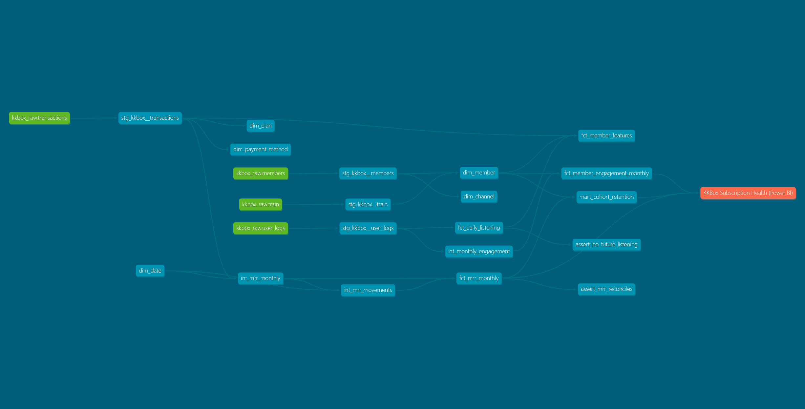
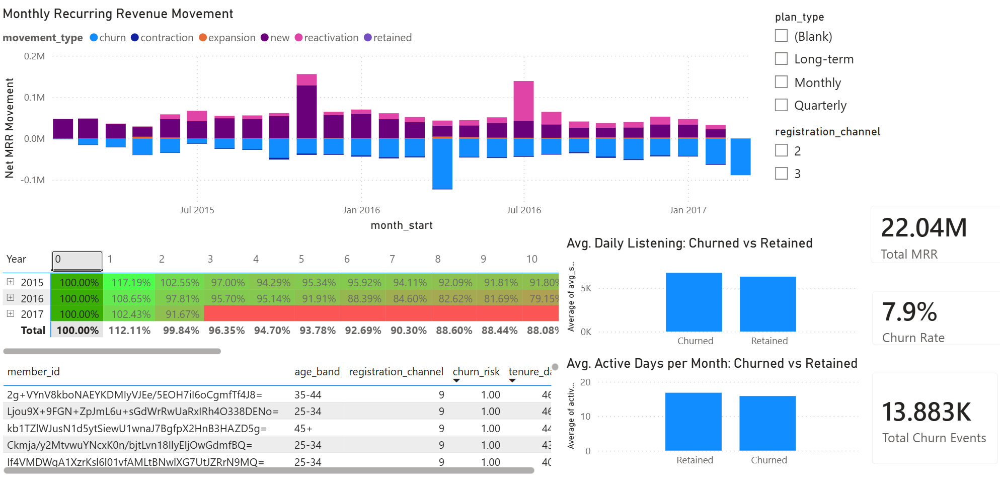

# KKBox Subscription Analytics

An end-to-end analytics-engineering project on real music-streaming data:
raw CSVs → a tested, documented **star schema** in BigQuery (via **dbt**) →
a **Power BI** dashboard → a **calibrated churn model**. Built to answer three
business questions: how is MRR moving, how does retention decay by cohort,
and does engagement fall before members churn?




## What it does

- Ingests real KKBox billing, usage, and member data (from a ~30M+ row raw
  source) into BigQuery, sampled at the **member** level down to a coherent
  50,000-member cohort so every join stays intact (140K+ transactions,
  136K+ daily listening records, 6,379 labeled members).
- Transforms it with dbt across staging → intermediate → marts layers.
- Models **MRR and its movements** (new / expansion / contraction / churn /
  reactivation / retained) using SQL window functions (`LAG`, `QUALIFY`)
  over a gap-filled monthly grid.
- Enforces quality with 30+ dbt tests: uniqueness, referential integrity, a
  custom `not_negative` generic test, and an **MRR reconciliation** singular
  test that cross-checks the revenue-movement logic against total MRR delta.
- Ships via **GitHub Actions CI**, running `dbt build` against BigQuery
  through a dedicated service account on every pull request.
- Visualizes an MRR waterfall, a cohort-retention heatmap, and
  engagement-vs-churn, plus a prioritized "members to save" table ranked by
  model risk score and tenure — all in a single Power BI dashboard,
  registered back into the dbt lineage graph as an **exposure**.
- Trains a **calibrated XGBoost** churn model on a leakage-safe feature mart,
  using a proper three-way train / calibration / test split so the
  calibration step never sees data the base model trained on. Explains it
  with **SHAP**, and writes per-member risk scores back to the warehouse.

## Results

- **ROC-AUC: 0.853** on a held-out test set.
- **Brier score: 0.109 → 0.061 (44.2% improvement)** after isotonic
  calibration, fit on a calibration slice disjoint from both training and
  test data — so the improvement is measured honestly, not on data the
  calibration step already saw.
- Top SHAP drivers of churn risk: see `docs/shap_summary.png`.

## Stack

SQL · dbt 1.11 (BigQuery) · Python 3.12 · Power BI · Git / GitHub Actions ·
XGBoost · scikit-learn · SHAP

## Architecture

```
kkbox_raw (BigQuery)
  └─ staging (clean, typed, deduped)
       └─ intermediate (MRR coverage, movements, monthly engagement)
            └─ marts: dims + facts ─┬─> Power BI dashboard (dbt exposure)
                                    └─> fct_member_features
                                         └─> calibrated XGBoost model
                                              └─> member_churn_scores
                                                   └─> Power BI risk table
```

## Repo layout

This repo's root **is** the dbt project (`dbt_project.yml`, `models/`,
`macros/`, `tests/`, `ci_profiles/` all live at the top level — there is no
nested `kkbox_dbt/` folder). `sample_data.py` and the Python ML script under
`ml/` sit alongside it. Raw data (`data/`), the venv, and dbt's generated
`target/`/`dbt_packages/` are git-ignored.

```
kkbox-subscription-analytics/
├── README.md
├── .gitignore
├── .github/workflows/dbt_ci.yml
├── sample_data.py
├── ci_profiles/profiles.yml
├── dbt_project.yml
├── packages.yml
├── models/
│   ├── staging/            # 4 staging models + _sources.yml
│   ├── intermediate/       # MRR coverage, movements, engagement
│   └── marts/core/         # 5 dims, facts, cohort retention, feature mart
├── macros/test_not_negative.sql
├── tests/                  # 2 singular tests (future listening, MRR reconciliation)
├── ml/
│   ├── train_churn.py
│   └── shap_summary.png
└── docs/                   # screenshots: lineage, dashboard, SHAP summary
```

## Run it yourself

1. Download the 4 KKBox files (WSDM Churn Prediction Challenge) from Kaggle
   into `data/`: `members_v3.csv`, `transactions.csv`, `user_logs_v2.csv`,
   `train_v2.csv`.
2. Create a Python 3.12 venv, `pip install -r requirements.txt`, then run
   `python sample_data.py` to sample down to a coherent 50k-member cohort.
3. Create a BigQuery dataset `kkbox_raw` and load the sampled CSVs, then
   from the repo root: `dbt deps && dbt build`.
4. `dbt docs generate && dbt docs serve` for docs and the lineage graph.
5. `python ml/train_churn.py` to train the model and write risk scores back
   to BigQuery (`dbt_dev_marts.member_churn_scores`).
6. Connect Power BI Desktop to the `_marts` BigQuery dataset to rebuild the
   dashboard: MRR waterfall, cohort retention, engagement vs. churn, and the
   risk-ranked member table.

## Key assumptions and known limitations

- **MRR** = monthly-equivalent price of the latest transaction covering each
  member-month (a documented approximation of true billing; doesn't model
  proration or refunds). Verified with a singular reconciliation test.
- **Retention cohorts** are anchored at each member's first *active MRR*
  month, not first registration or login.
- **Boundary effect:** the first and last months in the data window produce
  artificially inflated "new" and "churn" counts, because members active
  before/after the snapshot have no prior/later month to compare against.
  These edge months are excluded from the MRR-movement visuals.
- **`fct_daily_listening`** is materialized as a partitioned table, not
  incremental — BigQuery's free sandbox tier blocks the `MERGE` statements
  an incremental model requires. The incremental + MERGE config is left
  commented in the model for a billing-enabled environment.
- **Plan-type mix**: in this sampled cohort, Monthly plans dominate
  member-month activity (~87% of fact rows) versus Long-term (~12%) and
  Quarterly (~1%) — a real finding from the data, not a sampling artifact.
- Anonymized codes (`registration_channel`, `payment_method_id`) are
  presented as generic labels since KKBox doesn't disclose their real-world
  meaning.